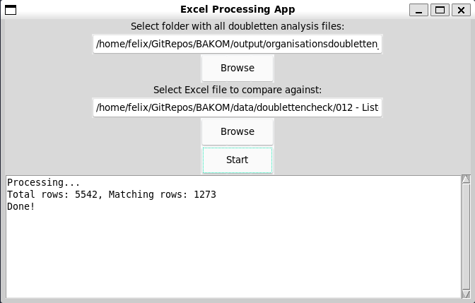

## Doubletten Check Tool

In the first input field select a folder containing any number of .xlsx analysis files.
In the second input field select the .xlsx "master" file containing all "Doubletten".

The tool checks if any *ReferenceID* of the analysis files is present in the master file and add a green background to the row.

produces an output in the same folder of the master file with suffix *_doublettencheck*.

## Developer remarks

Needs `sudo apt install python3.12-tk`
